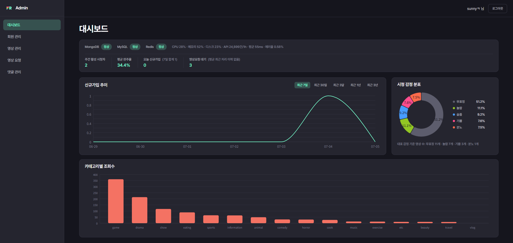
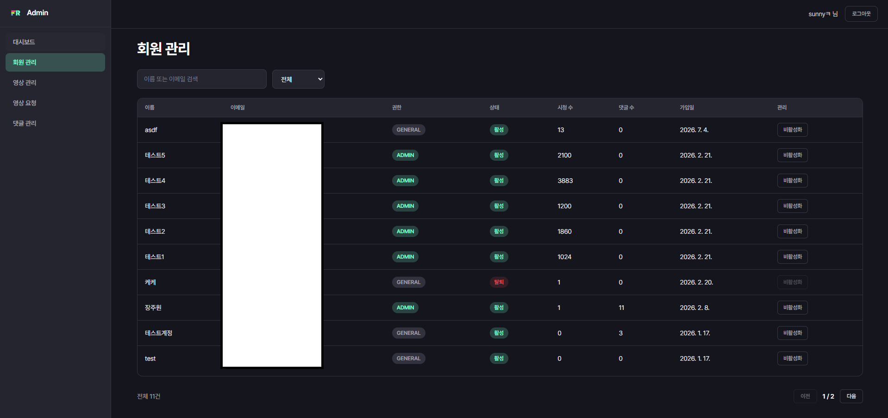
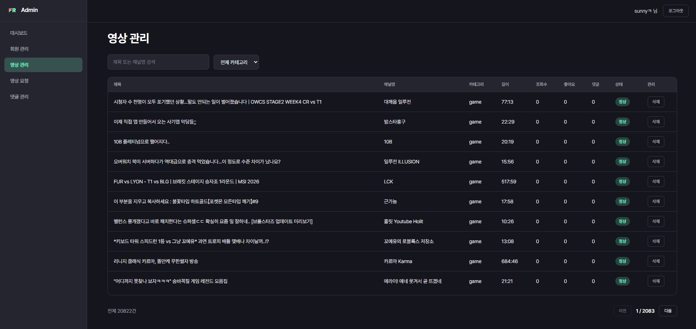
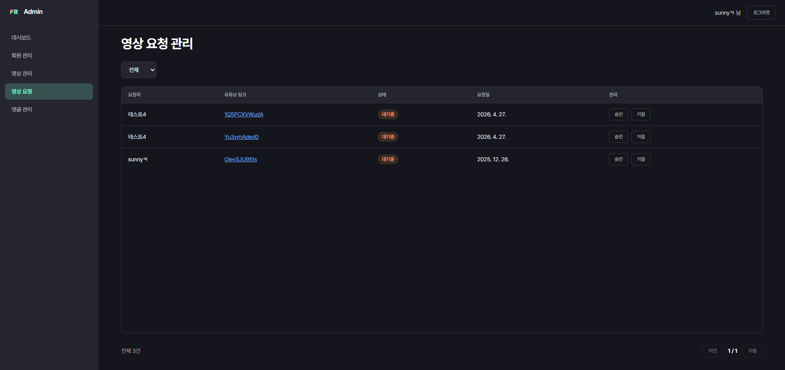
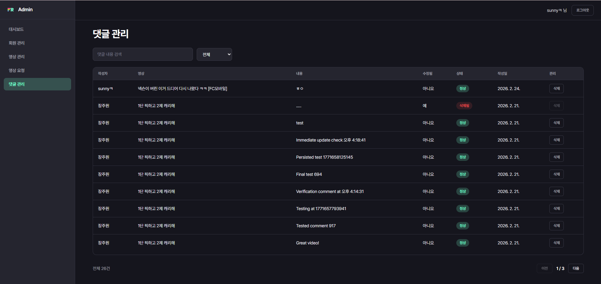

# FaceReview Admin

[FaceReview](https://github.com/winterholic/facereview-refactor-back) 서비스의 운영자용 관리자 페이지. 회원·영상·영상 등록 요청·댓글을 관리하고, 서비스 운영 상태와 핵심 비즈니스 지표를 대시보드에서 확인합니다.

- 백엔드: [`facereview-refactor-back`](https://github.com/winterholic/facereview-refactor-back)
- 기획 문서: [`docs/PLANNING.md`](docs/PLANNING.md)

---

## 서비스 현황을 한눈에

시스템 상태(MongoDB/MySQL/Redis 연결, CPU·메모리·디스크, API 응답시간·에러율)와 핵심 비즈니스 지표(WAU, 평균 완주율, 카테고리별 조회수, 시청 감정 분포)를 한 화면에서 확인합니다. 신규가입 추이는 최근 7일/30일/3달/1년/3년 중 원하는 기간을 골라 볼 수 있습니다.



## 회원과 권한을 관리하다

이름·이메일로 회원을 검색하고 활성/탈퇴 상태로 필터링하며, 문제가 있는 계정은 비활성화할 수 있습니다. 권한은 GENERAL/ADMIN/SUPER_ADMIN 3단계로 관리되고, 다른 회원을 ADMIN으로 지정하거나 해제하는 작업은 SUPER_ADMIN 계정에서만 가능하도록 제한해뒀습니다.



## 등록된 영상을 관리하다

제목·채널명으로 검색하고 카테고리로 좁혀가며 전체 영상을 둘러보고, 문제가 되는 영상은 바로 삭제(논리 삭제)할 수 있습니다.



## 새 영상 등록 요청을 검토하다

사용자가 등록을 요청한 유튜브 영상을 대기중/승인/거절 상태별로 확인합니다. 제목·채널명·길이·카테고리를 입력해 승인하면 바로 서비스에 등록되고, 거절할 때는 사유를 남겨야 합니다.



## 댓글을 모니터링하고 정리하다

영상별·키워드·삭제 여부로 댓글을 찾아보고, 부적절한 댓글은 삭제(논리 삭제)로 바로 정리할 수 있습니다.



---

## 기술 스택

- **Frontend**: React 19, TypeScript, Vite, React Router v7
- **상태/데이터**: Zustand(인증 상태), TanStack Query(서버 상태)
- **차트**: Nivo (Bar/Line/Pie)
- **스타일**: SCSS (FaceReview 서비스와 동일한 다크 디자인 토큰 재사용)
- **HTTP**: Axios (401 시 refresh 토큰 기반 자동 재발급 인터셉터)
- **배포**: Vercel

## 프로젝트 구조

```
src/
  api/            # axios 인스턴스, 도메인별 API 함수 (auth, admin)
  components/     # 공용 컴포넌트 (DataTable, Pagination, ConfirmModal, StatusChip 등)
  pages/          # 화면 단위 (login, dashboard, users, videos, video-requests, comments)
  store/          # zustand 스토어 (인증)
  styles/         # SCSS 디자인 토큰 및 공용 스타일
  types/          # API 응답 타입
```

## 실행 방법

```bash
npm install
cp .env.example .env.local   # VITE_API_BASE_URL 등 설정
npm run dev
```

| 명령어 | 설명 |
|---|---|
| `npm run dev` | 개발 서버 실행 |
| `npm run build` | 타입 체크 + 프로덕션 빌드 |
| `npm run preview` | 빌드 결과 미리보기 |
| `npm run lint` | Oxlint 실행 |
